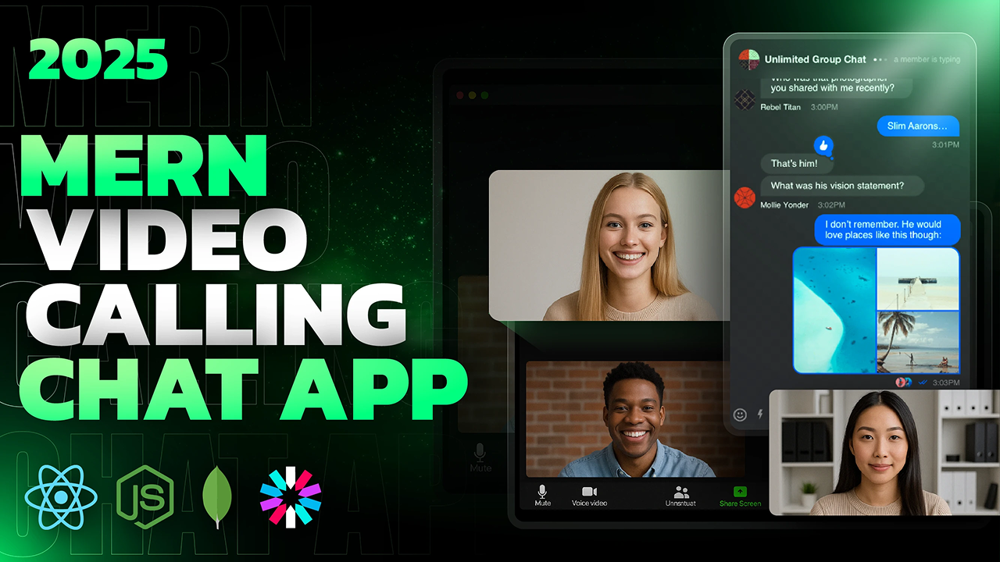
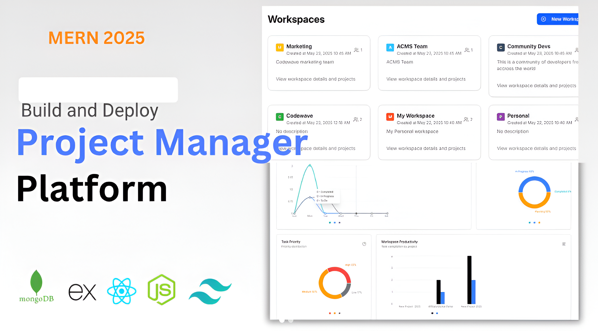
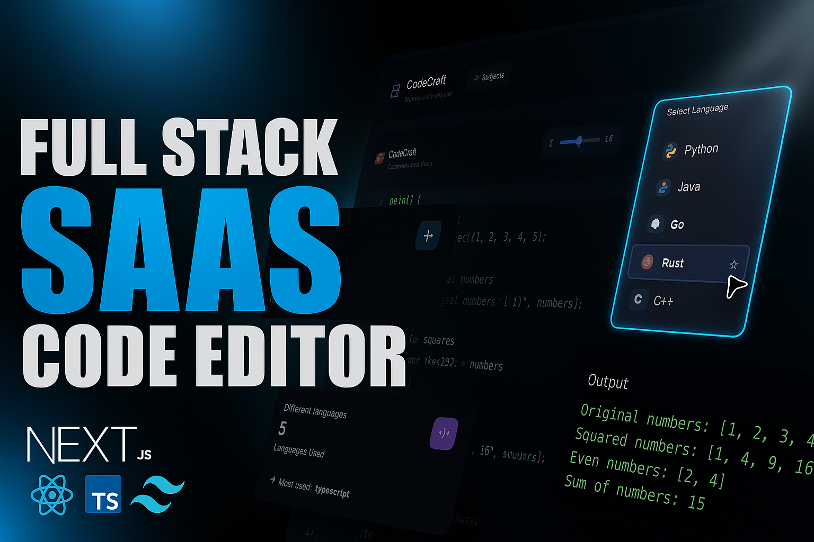
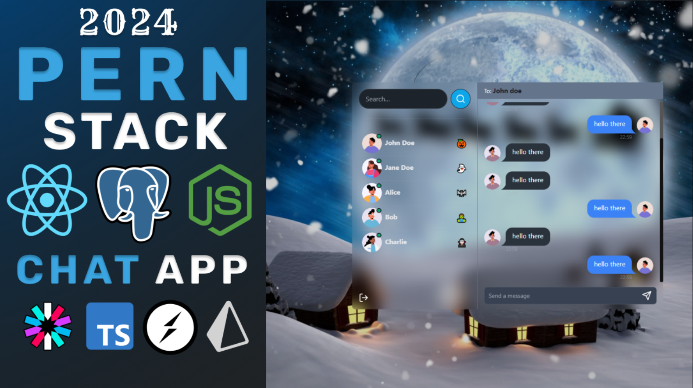
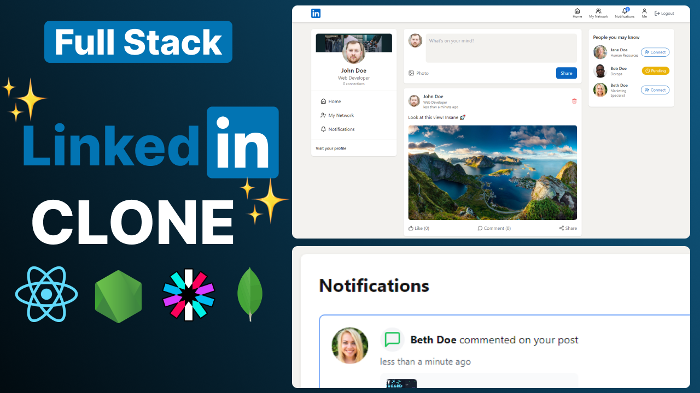

  <h3> 🚀 Full-Stack Software Developer. </h3>
  
<i>"A passionate software engineer who quickly adapts to new technologies and builds efficient, high-quality solutions."</i>

  

    
    
    
  

---

## 📖 About Me
- 🔭 **Current Role:** Full-stack Developer focusing on scalable system architecture.
- 🌱 **Learning Journey:** Deep-diving into Advanced DevOps and Microservices.
- 💡 **Philosophy:** I believe in writing code that is as beautiful as the UI it powers.
- ⚡ **Interests:** Competitive Programming, Open Source, and UI/UX Design.

---

# 💻 Tech Stack

<table width="100%">
  <tr>
    <td width="50%" valign="top">
      <h4>🎨 Frontend & Design</h4>
      
      
      
      
      
      
      
      
      
      
      
       
      
    </td>
    <td width="50%" valign="top">
      <h4>⚙️ Backend & Systems</h4>
      
      
      
      
      
      
      
      
    </td>
  </tr>
  <tr>
    <td width="50%" valign="top">
      <h4>💾 Databases & Mobile</h4>
      
      
      
       
      
      
      
    </td>
    <td width="50%" valign="top">
      <h4>☁️ DevOps & Cloud</h4>
      
      
       
      
      
      
    </td>
  </tr>
</table>

---

## 🚀 Featured Projects

  
  
  
   
  
  
  

---

## 📫 Let's Connect

  
  
  
  

 

<picture>
  <source media="(prefers-color-scheme: dark)" srcset="https://raw.githubusercontent.com/asmrprog-yt/asmrprog-yt/output/github-snake-dark.svg" />
  <source media="(prefers-color-scheme: light)" srcset="https://raw.githubusercontent.com/asmrprog-yt/asmrprog-yt/output/github-snake.svg" />
  
</picture>

